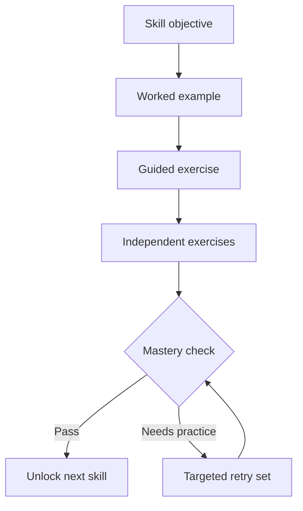

# Mahjong Academy

## Product and implementation design

**Status:** implementation-ready product specification  
**Version:** 0.1  
**Primary platform:** responsive web application / installable PWA  
**Game:** American Mahjong with pluggable card definitions  
**Core promise:** learn to read a hand card, convert an abstract pattern into concrete tiles, see what is missing, keep an alternative, pivot when conditions change, and eventually play a full game against bots.

---

## 1. Product thesis

American Mahjong overloads a beginner with several mental operations at once:

1. recognize the physical tiles;
2. read an abstract hand template;
3. apply suit and number constraints;
4. instantiate that template as a concrete 14-tile target;
5. compare the target with the current rack;
6. understand what is missing and what is extra;
7. retain one or more alternative targets;
8. react to discards, exposures, dead tiles, Jokers, and newly drawn tiles;
9. play the actual multiplayer game.

Most digital Mahjong products begin at step 9. Mahjong Academy teaches steps 1–8 progressively, then integrates them into a complete solo game against three deterministic bots.

The central visual model is:

> **My rack → abstract template → concrete target → missing tiles → alternative target**

The application must make this conversion visible. It must not merely show a numerical score or name a recommended hand.

---

## 2. Non-negotiable principles

### 2.1 No AI or LLM dependency

The product contains no generative AI, LLM calls, embeddings, probabilistic language explanations, image recognition, or opaque recommendation service.

All behavior is produced by:

- formal card definitions;
- exhaustive or bounded enumeration of valid hand instantiations;
- deterministic hand comparison;
- explicit scoring heuristics;
- seeded procedural exercise generation;
- deterministic or seeded bot policies;
- explanation templates populated with computed facts.

The same input and random seed must always produce the same result.

### 2.2 Teach one mental operation at a time

Early lessons do not simulate a full game. Each exercise isolates one skill. New rules appear only after prerequisite skills have been demonstrated.

### 2.3 Visual understanding before terminology

Whenever possible, use tile movement, grouping, empty slots, color, and spatial alignment before written explanations.

### 2.4 The player always sees evidence

Recommendations must be inspectable. "Discard 9 Bam" is insufficient. The interface should show that the tile is unused by the leading targets, while another tile supports both the primary and alternative hands.

### 2.5 Card definitions are content, not application code

The game, evaluator, lessons, and bots must not depend on a particular annual card. A card is loaded through a versioned declarative format.

### 2.6 Do not bundle protected annual card content without permission

Development and public demos use an original practice card. Official annual combinations are supported only through a legally approved distribution or user-entered/private card definition. Do not copy third-party tile artwork; use original SVG assets or assets with verified compatible licenses.

---

## 3. Audience and learning outcome

### Primary player

An adult beginner who understands basic Mahjong vocabulary but finds the annual American Mahjong card confusing and cannot quickly choose or change a target hand.

### Successful outcome

After completing the core path, the learner can:

- recognize every tile and suit;
- identify singles, pairs, pungs, kongs, and number sequences as visual structures;
- distinguish visual sequence practice from a legal American Mahjong meld;
- read colors, group sizes, suit constraints, number relationships, exposure rules, and Joker restrictions in a template;
- instantiate a template for legal suit and number assignments;
- arrange the current rack against a target and name missing and unused tiles;
- compare a primary target with at least one alternative;
- select Charleston passes without destroying useful overlap;
- recognize a dead or weakened target;
- pivot to a target that preserves more existing tiles;
- complete a full game against bots without mandatory assistance.

---

## 4. Product modes

### 4.1 Learn

A linear skill path made of short lessons. Each lesson contains instruction, guided examples, exercises, feedback, and a mastery check.

### 4.2 Practice

Unlimited procedural exercises filtered by skill, card section, difficulty, and weak areas. No lives or punishment. The player may reveal the construction one step at a time.

### 4.3 Play

One human and three bots play a complete American Mahjong game, including Charleston, draw/discard turns, calls, exposures, Jokers, and win validation.

Coach level is selected before a game:

| Level | Information shown |
| --- | --- |
| Off | Legal moves and rules errors only |
| Check | Player acts first, then may compare the move with the evaluator |
| Hint | Primary direction, alternative direction, and weak tiles |
| Guided | Target layout, missing tiles, suggested actions, and explanations |

"Off" still enforces legal rules; it does not offer strategy.

### 4.4 Daily drill (post-MVP)

A five-minute mixed session drawn from mastered skills and recent mistakes. It is a convenience mode, not a separate content system.

---

## 5. Learning path

Each node unlocks after its mastery requirement is met. A learner may test out of any unit.

### Unit 1 — Tile alphabet

1. **Find the pair** — select two identical tiles.
2. **Find all pairs** — identify several identical pairs among distractors.
3. **Name the tile** — number/suit, wind, dragon, flower, Joker.
4. **Sort a rack** — group by suit and rank.
5. **Spot the odd tile** — find the tile that breaks a group.

Goal: instant tile recognition without strategic reasoning.

### Unit 2 — Visual groups

1. Build a pair.
2. Find and build a pung (three identical tiles).
3. Find and build a kong (four identical tiles).
4. Recognize a numerical sequence such as 2-3-4.
5. Separate a mixed rack into visible groups.

Classical Chinese structures may be used here as a visual alphabet. The interface must explicitly state:

> A sequence is useful pattern-reading practice. It is not automatically a legal meld or winning group in American Mahjong; legality comes from the selected card line.

### Unit 3 — From groups to a 14-tile target

1. Copy a concrete target from a model.
2. Complete one missing slot.
3. Complete several missing slots.
4. Reject a 13- or 15-tile construction.
5. Build a full concrete Mahjong hand from a fixed tile tray.

This unit introduces the invariant that a winning target has exactly the required structure and tile count.

### Unit 4 — Read an abstract template

1. Read group boundaries: `FF | XXX | YYYY | ZZZZ`.
2. Map group length to pair/pung/kong.
3. Interpret same-color groups as same-suit requirements.
4. Interpret different colors as distinct-suit requirements.
5. Interpret number relationships: like numbers, consecutive, odds, evens, year digits, and fixed ranks.
6. Identify singles and pairs that Jokers cannot replace.
7. Identify concealed versus exposable targets.

The initial practice card uses unambiguous labels and a legend. Symbol-only presentation appears only after the learner understands the semantics.

### Unit 5 — Expand the template

1. Choose the legal suit for one variable group.
2. Assign two suit variables.
3. Assign three distinct suits.
4. Choose the legal starting number for a relative-number pattern.
5. Reject illegal assignments.
6. Generate all legal concrete versions of a template.
7. Select the version best aligned with a supplied rack.

Example:

```text
TEMPLATE
FF | aaa | bbbb | cccc
constraint: suits(a), suits(b), suits(c) are all different
numbers: a=2, b=4, c=6

BEST CONCRETE TARGET FOR THIS RACK
FF | 222 Bams | 4444 Dots | 6666 Craks
```

### Unit 6 — Hand, template, and missing tiles

This unit teaches the product's central screen.

1. Align owned tiles with a concrete target.
2. Place absent tiles into empty target slots.
3. Move non-matching tiles into **Extra**.
4. State what is missing by tile and count.
5. Distinguish a natural requirement from a Joker-compatible missing slot.
6. Compare two legal instantiations of the same template.

Required four-layer view:

```text
MY RACK      tiles as currently held
TEMPLATE     abstract groups and constraints
TARGET       best concrete instantiation
MISSING      empty slots plus textual counts
```

An optional fifth row shows **EXTRA / DISCARD CANDIDATES**.

### Unit 7 — Which hand is closer?

1. Choose between one close and several distant targets.
2. Compare targets with equal raw tile distance.
3. Prefer an available natural pair over an unavailable required pair.
4. Account for Joker-compatible versus natural-only deficits.
5. Account for visible dead tiles.
6. Compare flexibility: how many nearby targets share the same rack tiles.

The correct answer is derived from a documented lexicographic scoring policy, not a hidden percentage.

### Unit 8 — Primary and alternative

1. Pick the best target.
2. Pick an alternative that preserves maximum overlap.
3. Identify shared anchor tiles.
4. Identify commitment tiles used only by the primary.
5. Toggle between two targets and watch tiles move.
6. Explain the cost of a pivot as the number and quality of changed slots.

The learner must internalize:

> Choose a direction early; commit to an exact line only when evidence supports it.

### Unit 9 — Charleston

1. Remove three obvious orphan tiles.
2. Preserve pairs and natural-only requirements.
3. Preserve tiles shared by primary and alternative targets.
4. Compare two possible passes.
5. Adapt after receiving three tiles.
6. Practice blind-pass rules in a ruleset that permits them.
7. Complete a full Charleston with evaluation after each pass.

### Unit 10 — Draw and discard

1. Decide whether a drawn tile improves the primary.
2. Decide whether it improves the alternative.
3. Choose the weakest tile after a draw.
4. Avoid discarding a shared anchor.
5. Account for exposed and discarded tiles.
6. Recognize when offense should give way to defense.

### Unit 11 — Pivot

1. Detect a dead required single or pair.
2. Detect a target whose effective distance increased.
3. Recognize when the alternative becomes stronger than the primary.
4. Select the lowest-cost pivot.
5. Delay a premature pivot when both paths remain viable.
6. Pivot in a reconstructed mid-game state.

### Unit 12 — Jokers, calls, and exposures

1. Place Jokers only in allowed groups.
2. Reject Jokers in singles and pairs.
3. Decide whether to call a discard.
4. Understand how exposure narrows possible targets.
5. Exchange for an exposed Joker where rules allow.
6. Evaluate concealed-hand restrictions.

### Unit 13 — Build Mahjong from a template

Capstone sequence:

1. Given a template and full tile pool, build one valid concrete Mahjong.
2. Build a second legal instantiation of the same template.
3. Given a rack and pool, construct the closest valid Mahjong.
4. Given a rack, game state, primary, and alternative, complete the correct target.
5. Play a guided full game.
6. Play an unguided full game against bots.

---

## 6. Exercise interaction patterns

Use a small reusable vocabulary of interactions rather than custom UI for every lesson.

| Interaction | Player action | Typical use |
| --- | --- | --- |
| Select | tap one or more tiles/options | find a pair, select closest hand |
| Drag to group | move tiles into labeled trays | pair/pung/kong, sort rack |
| Fill slots | drag tiles into target gaps | missing tiles, build Mahjong |
| Assign variable | choose suit/rank for a pattern token | template expansion |
| Toggle comparison | switch Primary/Alternative | pivot and overlap |
| Pass three | place exactly three tiles in pass tray | Charleston |
| Discard one | place one tile in discard area | turn decisions |
| Continue or pivot | choose a strategy action and target | mid-game scenarios |

### Feedback sequence

1. Accept the player's complete action; do not interrupt every tile movement.
2. Mark the result as correct, acceptable, weak, or illegal.
3. Animate the canonical arrangement.
4. Show no more than three computed reasons.
5. Allow **Show another way** when multiple solutions are valid.
6. Offer retry with the same state or continue with a new seeded state.

Never treat a strategically reasonable alternative as simply "wrong." Use tiers:

- **Best** — top-ranked by the declared policy;
- **Good** — within a configured tolerance and strategically sound;
- **Risky** — legal but loses meaningful flexibility or availability;
- **Illegal** — violates a rule or template constraint.

---

## 7. Central visual design

### 7.1 Tile design

Create an original SVG tile set. Every suited tile has:

- a large Arabic numeral in a consistent corner;
- a strong suit marker/color independent of traditional artwork;
- traditional-inspired central artwork;
- sufficient contrast at phone size;
- a text alternative such as `6 Bamboo`;
- a color-blind-safe suit shape, not color alone.

Display modes:

| Mode | Appearance |
| --- | --- |
| Learning | large number, suit label, suit shape, traditional artwork |
| Assisted | number and suit shape remain; label removed |
| Traditional | original tile artwork with small accessibility corner index |

The player can switch manually. Lessons may recommend a mode but must not silently change a user preference.

### 7.2 Rack arrangement modes

**Natural rack:** normal suit/rank sorting used during play.  
**Pattern rack:** tiles rearranged under target groups.  
**Comparison rack:** stable shared tiles plus animated changes between Primary and Alternative.  
**Availability rack:** target slots annotated with live/unseen/dead counts.

### 7.3 Pattern rack anatomy

```text
ABSTRACT    FF | aaa | bbbb | cccc
ASSIGNMENT       2B    4D     6C
TARGET      FF | 222B | 4444D | 6666C
OWNED       F_ | 22_B | 444_D | 66__C
EXTRA       N  8B  3C
```

In the rendered interface, every underscore is a full empty tile slot. Slot states:

- **Owned:** normal tile;
- **Missing/live:** outlined empty tile;
- **Missing/Joker-compatible:** outlined slot with small Joker badge;
- **Natural-only:** lock/natural badge;
- **Dead:** red strike or blocked slot, never color alone;
- **Shared with alternative:** link badge;
- **Extra:** physically separated below the target.

### 7.4 Primary/Alternative transition

The target card includes tabs: **Primary**, **Alternative**, and **Compare**.

In Compare mode:

- shared tiles remain stationary;
- reassigned tiles slide to their new group;
- newly unnecessary tiles move to Extra;
- newly required tiles appear as empty slots;
- a compact summary reads, for example: `10 tiles preserved · 2 new natural tiles needed · 1 group changes suit`.

Motion must be optional under reduced-motion accessibility settings. With motion disabled, use before/after highlighting.

### 7.5 Do not encode rules only through card colors

The original card may use colors as abstract suit variables. The application pairs every color with a variable label and shape: `Suit A ●`, `Suit B ▲`, `Suit C ■`. Actual suits use their own labels and icons.

---

## 8. Core user flows

### 8.1 First session

1. Welcome: "Learn to turn a pattern into a playable hand."
2. Choose tile appearance: Learning or Traditional.
3. Five-question placement check.
4. Start at the recommended unit; user may start from Unit 1 instead.
5. Complete a 3–5 minute lesson.
6. Show the newly unlocked node and one concrete skill gained.

No account is required for the first session. Local progress is the MVP default.

### 8.2 Lesson flow



### 8.3 Guided game flow

1. Select practice card/ruleset, bot level, and coach level.
2. Deal and sort.
3. Evaluator initially presents directions/categories, not forced exact commitment.
4. Complete Charleston; after each pass show what was preserved or weakened.
5. Establish Primary and Alternative targets.
6. On each draw, update target layouts and availability.
7. Player acts; optional Check compares the action with evaluated alternatives.
8. Prompt for a pivot only when a declared threshold is crossed.
9. Validate calls, exposures, Joker exchanges, and Mahjong.
10. End-of-game review replays at most three high-value decisions.

### 8.4 Pivot flow

Trigger the visual prompt when any condition is true:

- alternative score exceeds primary by `pivotPromptDelta`;
- a natural-only missing tile becomes dead;
- exposure makes the primary illegal;
- primary effective distance rises by at least 2 from its best historical value;
- player explicitly taps Compare.

The prompt shows evidence, never a dramatic warning:

```text
PRIMARY weakened
One required 6 Bam pair is no longer available.

ALTERNATIVE now preserves 10 rack tiles.
Changing target requires replacing 3 tiles.

[Keep primary] [Compare] [Pivot]
```

### 8.5 End-of-game review

Select decisions by regret/value difference, with one example from each applicable phase:

- Charleston pass;
- commitment or pivot;
- discard/call.

For each, show state before action, chosen action, strongest alternative, and computed reason. Never generate a paragraph dynamically; assemble localized sentence templates from facts.

---

## 9. Deterministic game engine

### 9.1 Domain modules

```text
packages/
  tile-model/          tile identities, counts, serialization
  card-schema/         schema and validation
  pattern-expander/    abstract template -> concrete targets
  hand-evaluator/      matching, deficits, availability, ranking
  rules-engine/        turns, Charleston, calls, Jokers, wins
  bot-engine/          legal action generation and policies
  lesson-engine/       curriculum and procedural exercises
  explanation-engine/ fact records -> localized templates
  ui-components/       tiles, racks, target comparison
apps/
  web/                 responsive PWA
content/
  practice-card/       original development card
  lessons/             lesson manifests and strings
```

Keep these as internal packages in one repository for MVP. A distributed backend is unnecessary.

### 9.2 Tile identity

Use canonical IDs independent of artwork:

```ts
type Suit = 'bamboo' | 'dots' | 'characters';
type Wind = 'east' | 'south' | 'west' | 'north';
type Dragon = 'red' | 'green' | 'white';

type TileId =
  | `${Suit}:${1|2|3|4|5|6|7|8|9}`
  | `wind:${Wind}`
  | `dragon:${Dragon}`
  | `flower`
  | `joker`;
```

Individual physical copies may receive instance IDs for animation and replay, but matching operates on canonical IDs.

### 9.3 Card definition

A card definition contains metadata, ruleset compatibility, sections, lines, display tokens, semantic groups, constraints, and exposure/Joker rules. Display is derived from semantics; it is not the source of truth.

Illustrative YAML:

```yaml
schemaVersion: 1
id: practice-card-v1
title: Academy Practice Card
handSize: 14
sections:
  - id: even-runs
    title: Even Runs
    hands:
      - id: even-runs-01
        label: "FF aaa bbbb cccc"
        concealed: false
        groups:
          - { kind: flowers, count: 2, joker: forbidden }
          - { kind: sameTile, count: 3, rank: 2, suit: A, joker: allowed }
          - { kind: sameTile, count: 4, rank: 4, suit: B, joker: allowed }
          - { kind: sameTile, count: 4, rank: 6, suit: C, joker: allowed }
        constraints:
          - { kind: allDifferentSuits, variables: [A, B, C] }
```

The schema must support at minimum:

- fixed tile IDs;
- suit variables;
- rank variables and finite domains;
- same/different suit constraints;
- equal, consecutive, offset, odd/even, and finite-set rank constraints;
- flower groups;
- dragon/suit relationships when required by a ruleset;
- singles, pairs, pungs, kongs, and quints;
- Joker eligibility per group;
- concealed-hand flag;
- exposure grouping rules;
- display notes that do not change semantics.

Avoid arbitrary executable expressions in card files. Use a closed, validated constraint vocabulary.

### 9.4 Pattern expansion

Input: semantic hand template and ruleset.  
Output: all legal concrete 14-tile targets.

Algorithm:

1. build finite domains for every suit and rank variable;
2. enumerate assignments with early constraint pruning;
3. materialize semantic groups into tile multisets;
4. reject assignments exceeding physical tile counts;
5. normalize equivalent results;
6. retain provenance mapping from every concrete tile slot to its template group and variable assignment.

Expansion is cacheable by `(cardVersion, handId)`.

### 9.5 Hand matching

For each concrete target, compute an optimal allocation of rack tiles and Jokers to target slots. The result must include:

```ts
interface HandMatch {
  handId: string;
  targetId: string;
  assignment: Record<string, string | number>;
  owned: SlotMatch[];
  missingNatural: MissingTile[];
  missingJokerEligible: MissingTile[];
  extras: TileInstanceId[];
  rawDistance: number;
  effectiveDistance: number;
  liveCopies: Record<TileId, number>;
  deadRequirements: MissingTile[];
}
```

Matching must maximize natural matches first where singles/pairs require them, then allocate Jokers legally. Implement as a small bipartite matching or dynamic program; do not rely on greedy rack order.

### 9.6 Ranking policy

Do not present invented "probabilities" in MVP. Rank candidates lexicographically with visible components:

1. legal/reachable before illegal/dead;
2. fewer dead natural-only requirements;
3. lower effective distance;
4. fewer missing natural singles/pairs;
5. greater live-copy availability for required tiles;
6. greater overlap with other top candidates;
7. fewer commitment tiles;
8. stable tie-break by card order and target ID.

`effectiveDistance` is a documented integer cost:

```text
1 per missing normal slot
+ configurable penalty for each missing natural-only slot
+ configurable penalty for low availability
+ unreachable sentinel if a natural-only requirement is dead
```

Keep weight values in a versioned evaluator policy, not scattered through UI code.

### 9.7 Primary and alternative selection

Primary is the top candidate under the ranking policy. Alternative is not simply candidate #2. Select it from candidates that:

- are not equivalent instantiations of the same target unless the lesson is about suit expansion;
- remain reachable;
- share useful rack tiles with Primary;
- preserve a different path if Primary weakens.

Rank alternatives using candidate quality plus pivot overlap:

```text
pivotCost = tiles currently useful to Primary but not Alternative
          + weighted missing natural-only slots in Alternative
```

Return `sharedTiles`, `primaryOnlyTiles`, `alternativeOnlyTiles`, and `changedGroups` for direct UI rendering.

### 9.8 Availability and dead tiles

For each canonical tile:

```text
live copies = total physical copies
            - copies in player's rack
            - visible discards
            - visible exposures
```

Do not subtract hidden opponent tiles. A requirement is dead only when the number of live copies plus legally usable rack Jokers cannot satisfy it, considering natural-only restrictions.

---

## 10. Bots without AI

Bots use the same evaluator exposed to the learner. They may not inspect hidden opponent racks or wall order.

### Bot turn policy

1. enumerate legal actions;
2. evaluate the resulting private rack and public state for each action;
3. select an action under the configured policy;
4. use a seeded tie-breaker;
5. optionally include a defensive risk term based only on visible information.

### Difficulty levels

| Level | Policy |
| --- | --- |
| Beginner | chooses among top candidates, ignores defense and deeper call consequences |
| Standard | uses full current-state evaluator, availability, Primary/Alternative, and basic call cost |
| Advanced | evaluates one draw/discard ply, opponent exposure compatibility, and defensive risk |

Advanced is explicitly search depth plus heuristics, not machine learning.

### Bot requirements

- reproducible from game seed;
- legal under all supported rules;
- never accesses hidden information;
- action decision can emit a structured reason record for testing;
- thinking delay is a presentation setting, not computation randomness;
- full game can run headlessly for simulation tests.

---

## 11. Procedural lesson generation

Exercises should be generated from known valid targets, then transformed predictably.

### General generator

1. choose a skill-compatible template and legal instantiation;
2. remove `n` target tiles according to difficulty;
3. add legal distractors with controlled similarity;
4. compute all candidate solutions;
5. reject ambiguous examples unless ambiguity is the lesson objective;
6. store seed and expected evaluation facts.

### Difficulty controls

| Dimension | Easy | Medium | Hard |
| --- | --- | --- | --- |
| Missing tiles | 1–2 | 3–4 | 4+ |
| Candidate targets | one obvious | two close | several tied by raw distance |
| Distractors | other suits/ranks | related ranks | useful to alternative hands |
| Natural-only risk | none | one pair | dead/low-availability pair |
| Suit variables | fixed/one | two | all suits plus rank variable |
| Game state | rack only | some discards | exposures and availability |

Every generated exercise must pass a solver-based validation before display.

### Mastery model

Track mastery per skill, not per lesson page. A simple deterministic model is sufficient:

- recent independent attempt window: 8 questions;
- mastered: at least 7 correct, including the latest 3, with no hint;
- needs review: 2 errors in the last 5 attempts;
- hints convert the attempt to guided and do not count toward mastery;
- response time may be shown to the learner but does not gate progress in MVP.

---

## 12. Explanation engine

Evaluation modules return facts, never prose:

```ts
type ReasonFact =
  | { type: 'unusedByTopCandidates'; tile: TileId; candidateCount: number }
  | { type: 'sharedAnchor'; tile: TileId; candidateIds: string[] }
  | { type: 'naturalPairPreserved'; tile: TileId }
  | { type: 'deadRequirement'; tile: TileId; required: number; live: number }
  | { type: 'lowerPivotCost'; from: string; to: string; preserved: number }
  | { type: 'distanceChange'; handId: string; before: number; after: number };
```

The presentation layer maps facts to short localized strings. Example:

```text
Recommended discard: 9 Bamboo
• It is used by 0 of your top 5 reachable targets.
• Keeping 6 Dots preserves both Primary and Alternative.
```

This makes explanations stable, testable, translatable, and auditable.

---

## 13. State and persistence

### Game state

Use an event log plus derived state:

```ts
type GameEvent =
  | DealEvent
  | CharlestonPassEvent
  | DrawEvent
  | DiscardEvent
  | CallEvent
  | ExposureEvent
  | JokerExchangeEvent
  | DeclareMahjongEvent;
```

Benefits: undo in practice, deterministic replay, bot debugging, lesson reconstruction, and end-of-game review.

### Local-first MVP

Persist in IndexedDB/local storage:

- settings and accessibility preferences;
- curriculum progress and mastery attempts;
- active lesson;
- active/recent games;
- installed card definitions and content versions.

Design repository interfaces so cloud synchronization can be added later without changing domain modules. Do not require login or backend services for MVP.

---

## 14. Screens

### Home

- Continue lesson;
- current skill path position;
- Practice;
- Play against bots;
- recent mastery areas.

### Skill path

A vertical sequence of compact nodes grouped by units. Show skill names, not decorative currencies. Locked nodes reveal prerequisites.

### Lesson player

- single instruction line;
- large central rack/work area;
- template/target panel when applicable;
- Check button;
- hint ladder: `Highlight groups → Show assignment → Arrange target`;
- feedback drawer that does not replace the rack.

### Game table

Landscape-friendly but usable in portrait:

- opponents and exposed groups around the table;
- discard pool centered;
- player's rack at bottom;
- compact Primary/Alternative coach panel above rack;
- target detail opens as a bottom sheet on mobile and side panel on desktop;
- legal call controls appear near the relevant discard.

### Card browser

- sections and lines;
- abstract pattern;
- plain-language semantic breakdown;
- "Show for my rack" when a rack exists;
- legal instantiations;
- no image or copied layout of an unlicensed annual card.

### Game review

- timeline scrubber;
- selected high-value decisions;
- before/after target layouts;
- chosen action and alternatives;
- replay from decision in practice mode.

---

## 15. Accessibility and usability

- minimum 44×44 CSS pixel interactive targets;
- keyboard operation for all drag actions via select-then-place alternative;
- screen-reader labels include full tile identity and group position;
- never rely on color alone;
- reduced-motion mode;
- scalable tile size and text;
- left-handed rack action layout option post-MVP;
- English-first architecture with all strings externalized; Russian localization should require content translation only;
- no timer pressure in curriculum lessons;
- confirm destructive actions such as abandoning an active game.

---

## 16. MVP scope

### Included

- responsive PWA;
- original SVG tile set in Learning and Traditional modes;
- original practice card covering core pattern constructs;
- Units 1–11 with at least one generator per exercise family;
- deterministic pattern expansion and hand evaluator;
- Primary/Alternative/Missing visual system;
- Charleston training;
- full four-seat game with three Beginner/Standard bots;
- Guided, Hint, Check, and Off coach levels;
- Joker, exposure, call, and win validation needed by the practice ruleset;
- local progress, replay, and three-decision game review;
- card schema documentation and validator.

### Excluded from MVP

- camera tile recognition;
- generative explanations;
- online multiplayer;
- accounts or cloud sync;
- subscriptions, social leagues, streak punishment, or virtual currency;
- licensed annual card distribution;
- advanced defensive bot;
- native mobile application;
- content authoring GUI.

---

## 17. Implementation phases

### Phase 0 — Rules and content spike

- define physical tile inventory and practice ruleset;
- create 8–12 original practice hands exercising every required constraint;
- validate card schema against the hardest planned templates;
- document ambiguous American Mahjong rules as explicit configuration choices.

Exit: every practice hand expands to the expected finite target set without special-case code.

### Phase 1 — Visual learning kernel

- tile components and accessibility;
- rack sorting and drag/select interactions;
- pattern rack with empty slots;
- Units 1–6;
- seeded exercise generator and solver validation.

Exit: a learner can progress from Find a Pair to identifying Missing tiles for a concrete target.

### Phase 2 — Evaluator and alternatives

- optimal hand matching;
- ranking policy and reason facts;
- Primary/Alternative comparison;
- availability/dead-tile calculation;
- Units 7, 8, and 11.

Exit: the same rack/game state yields stable ranked targets, visible missing tiles, and a computed pivot comparison.

### Phase 3 — Charleston and turns

- core rules state machine;
- Charleston variants;
- draw/discard loop;
- calls, exposures, Jokers, and win validation;
- Units 9, 10, and 12.

Exit: headless legal games can progress from deal to win or exhausted wall.

### Phase 4 — Bots and full game

- Beginner and Standard policies;
- game table UI;
- all coach levels;
- event replay and review;
- Unit 13 capstones.

Exit: a new player can finish a guided game and replay three evaluated decisions.

### Phase 5 — Product hardening

- performance and property-based tests;
- offline installation;
- saved progress migrations;
- localization pass;
- accessibility audit;
- legal/content review before any non-original card is distributed.

---

## 18. Testing strategy

### Unit tests

- tile multiset operations;
- every constraint type;
- template expansion counts and normalized outputs;
- Joker allocation and natural-only matching;
- availability and dead-hand detection;
- deterministic ranking and tie-breaking;
- legal actions for every game phase;
- reason facts correspond to actual computed differences.

### Property-based tests

- every expanded target contains exactly 14 tiles;
- no target exceeds physical tile inventory;
- suit/rank assignments satisfy all constraints;
- generated exercises always have declared solution cardinality;
- bots never select illegal actions;
- replaying an event log reproduces identical state;
- identical seed plus content versions produces identical exercise/game.

### Golden scenario tests

Store human-readable fixtures for:

- equal raw distance but different natural-pair difficulty;
- a target becoming dead after visible discards;
- Primary/Alternative switch after a draw;
- Charleston pass preserving overlap;
- legal and illegal Joker use;
- exposure invalidating a concealed target;
- multiple valid instantiations of one abstract template.

### UI tests

- drag and keyboard placement parity;
- target slots align at supported screen widths;
- Primary/Alternative transition preserves correct tile identity;
- color-blind and reduced-motion modes;
- interrupted lesson/game resumes exactly.

---

## 19. MVP acceptance criteria

The MVP is ready when all statements are true:

1. A first-time user can complete Unit 1 without reading external rules.
2. A learner can expand a template into a concrete target using suit/rank assignments.
3. For any supported rack and template, the UI visibly separates Owned, Missing, and Extra tiles.
4. The user can toggle Primary and Alternative and see exactly which tiles are preserved or changed.
5. The evaluator explains a recommended pass/discard using computed reason facts.
6. A practice scenario can make a target dead and trigger a correct pivot comparison.
7. A full legal game can be completed against three bots with coach Off.
8. The same game seed and actions produce an identical replay.
9. No network request is required for lessons, evaluation, explanations, or bot play.
10. No third-party annual card content or copied commercial tile artwork ships in the repository without documented permission.

---

## 20. Open decisions before coding Phase 3

These do not block the visual learning kernel but must be made explicit before the full rules engine is frozen:

- exact Charleston variants and optional second Charleston behavior;
- blind pass constraints;
- calling and exposure edge cases;
- Joker exchange timing;
- wall size and flower treatment for the selected practice ruleset;
- draw-game and invalid-Mahjong consequences;
- whether annual card definitions are user-authored locally or supplied through licensing;
- whether the first UI language is English only or English plus Russian.

Record each decision in a versioned ruleset file. Do not hide a rule choice in UI logic.

---

## 21. Recommended first vertical slice

Build one complete, narrow experience before the full game:

1. original tile set;
2. one practice template with suit variables;
3. one supplied rack;
4. Pattern Expander generates concrete targets;
5. Hand Evaluator selects Primary and Alternative;
6. UI renders Template, Target, Owned, Missing, and Extra;
7. player toggles the alternative and sees changed tiles;
8. player chooses a discard;
9. explanation engine shows two computed reasons;
10. fixture test proves the entire result is deterministic.

This slice exercises the product's unique value before investing in the complete game table. If this interaction is not immediately understandable, refine it before implementing bots or the full curriculum.

---

## 22. Definition of the product in one sentence

**Mahjong Academy is a deterministic, visual learning game that teaches a player to compile an abstract American Mahjong template into a concrete target, understand the current hand and its alternative, identify what is missing, and apply that skill in a full game against bots.**

